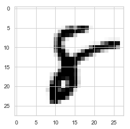

```python
import tensorflow as tf
```


```python
from tensorflow.examples.tutorials.mnist import input_data
```


```python
mnist = input_data.read_data_sets("MNIST_data/", one_hot=True) # y값 one-hot으로 바꿔주기
```

    WARNING:tensorflow:From <ipython-input-4-a839aeb82f4b>:1: read_data_sets (from tensorflow.contrib.learn.python.learn.datasets.mnist) is deprecated and will be removed in a future version.
    Instructions for updating:
    Please use alternatives such as official/mnist/dataset.py from tensorflow/models.
    WARNING:tensorflow:From C:\ProgramData\Anaconda3\lib\site-packages\tensorflow\contrib\learn\python\learn\datasets\mnist.py:260: maybe_download (from tensorflow.contrib.learn.python.learn.datasets.base) is deprecated and will be removed in a future version.
    Instructions for updating:
    Please write your own downloading logic.
    WARNING:tensorflow:From C:\ProgramData\Anaconda3\lib\site-packages\tensorflow\contrib\learn\python\learn\datasets\base.py:252: _internal_retry.<locals>.wrap.<locals>.wrapped_fn (from tensorflow.contrib.learn.python.learn.datasets.base) is deprecated and will be removed in a future version.
    Instructions for updating:
    Please use urllib or similar directly.
    Successfully downloaded train-images-idx3-ubyte.gz 9912422 bytes.
    WARNING:tensorflow:From C:\ProgramData\Anaconda3\lib\site-packages\tensorflow\contrib\learn\python\learn\datasets\mnist.py:262: extract_images (from tensorflow.contrib.learn.python.learn.datasets.mnist) is deprecated and will be removed in a future version.
    Instructions for updating:
    Please use tf.data to implement this functionality.
    Extracting MNIST_data/train-images-idx3-ubyte.gz
    Successfully downloaded train-labels-idx1-ubyte.gz 28881 bytes.
    WARNING:tensorflow:From C:\ProgramData\Anaconda3\lib\site-packages\tensorflow\contrib\learn\python\learn\datasets\mnist.py:267: extract_labels (from tensorflow.contrib.learn.python.learn.datasets.mnist) is deprecated and will be removed in a future version.
    Instructions for updating:
    Please use tf.data to implement this functionality.
    Extracting MNIST_data/train-labels-idx1-ubyte.gz
    WARNING:tensorflow:From C:\ProgramData\Anaconda3\lib\site-packages\tensorflow\contrib\learn\python\learn\datasets\mnist.py:110: dense_to_one_hot (from tensorflow.contrib.learn.python.learn.datasets.mnist) is deprecated and will be removed in a future version.
    Instructions for updating:
    Please use tf.one_hot on tensors.
    Successfully downloaded t10k-images-idx3-ubyte.gz 1648877 bytes.
    Extracting MNIST_data/t10k-images-idx3-ubyte.gz
    Successfully downloaded t10k-labels-idx1-ubyte.gz 4542 bytes.
    Extracting MNIST_data/t10k-labels-idx1-ubyte.gz
    WARNING:tensorflow:From C:\ProgramData\Anaconda3\lib\site-packages\tensorflow\contrib\learn\python\learn\datasets\mnist.py:290: DataSet.__init__ (from tensorflow.contrib.learn.python.learn.datasets.mnist) is deprecated and will be removed in a future version.
    Instructions for updating:
    Please use alternatives such as official/mnist/dataset.py from tensorflow/models.
    


```python
# set variables 
nb_classes = 10

X = tf.placeholder(tf.float32, shape=[None, 784])
Y = tf.placeholder(tf.float32, shape=[None, nb_classes])

w = tf.Variable(tf.random_normal([784, nb_classes]), name='weight')
b = tf.Variable(tf.random_normal([nb_classes]), name='bias')
```


```python
# set hypothesis
hypothesis = tf.nn.softmax(tf.matmul(X,w)+b)
```


```python
# set cost function
cost = tf.reduce_mean(-tf.reduce_sum(Y * tf.log(hypothesis), axis=1))
```


```python
# set optimizer and minimize
optimizer = tf.train.GradientDescentOptimizer(learning_rate=0.1).minimize(cost)
```


```python
# Test model
is_correct = tf.equal(tf.argmax(hypothesis,1), tf.argmax(Y,1))
```


```python
# Calculate accuracy
accuracy = tf.reduce_mean(tf.cast(is_correct,tf.float32))
```


```python
# Training epoch/batch
# 1000개의 데이터, batch size가 500이라면 total batch는 2이고, 
# 두번째 batch를 돌면 1epoch가 된다,
training_epochs = 15 # 전체 데이터 셋을 한번 학습시킨 것(한바퀴 돈 것)
batch_size = 100

with tf.Session() as sess:
    sess.run(tf.global_variables_initializer())
    
    for epoch in range(training_epochs):
        avg_cost = 0
        total_batch = int(mnist.train.num_examples / batch_size)
        
        for i in range(total_batch):
            # 데이터가 많으므로 100씩 호출
            batch_xs, batch_ys = mnist.train.next_batch(batch_size)
            c, _ = sess.run([cost, optimizer], feed_dict={X:batch_xs, Y:batch_ys})
            avg_cost += c / total_batch
        print("Epoch:", '%04d' % (epoch + 1), 'cost=', '{:.9f}'.format(avg_cost))
    
    # Test the model using test sets
    # sess.run() == accuracy.eval()
    print("Accuracy: ", accuracy.eval(session=sess, feed_dict={X:mnist.test.images, Y:mnist.test.labels}))
```

    Epoch: 0001 cost= 3.106490630
    Epoch: 0002 cost= 1.163147473
    Epoch: 0003 cost= 0.910800812
    Epoch: 0004 cost= 0.790241858
    Epoch: 0005 cost= 0.715625752
    Epoch: 0006 cost= 0.663265354
    Epoch: 0007 cost= 0.623770156
    Epoch: 0008 cost= 0.592704001
    Epoch: 0009 cost= 0.567818008
    Epoch: 0010 cost= 0.546562001
    Epoch: 0011 cost= 0.527640904
    Epoch: 0012 cost= 0.512633685
    Epoch: 0013 cost= 0.498606851
    Epoch: 0014 cost= 0.486469771
    Epoch: 0015 cost= 0.475411175
    Accuracy:  0.8877
    

### Sample image show and prediction


```python
import random
```


```python
with tf.Session() as sess:
    sess.run(tf.global_variables_initializer())

    r = random.randint(0, mnist.test.num_examples - 1)
    print("Label:", sess.run(tf.argmax(mnist.test.labels[r:r+1], 1)))
    print("Prediction:", sess.run(tf.argmax(hypothesis, 1), feed_dict={X: mnist.test.images[r:r+1]}))

    plt.imshow(mnist.test.images[r:r+1].reshape(28,28), cmap='Greys', interpolation='nearest')
    plt.show()
```

    Label: [8]
    Prediction: [7]
    




